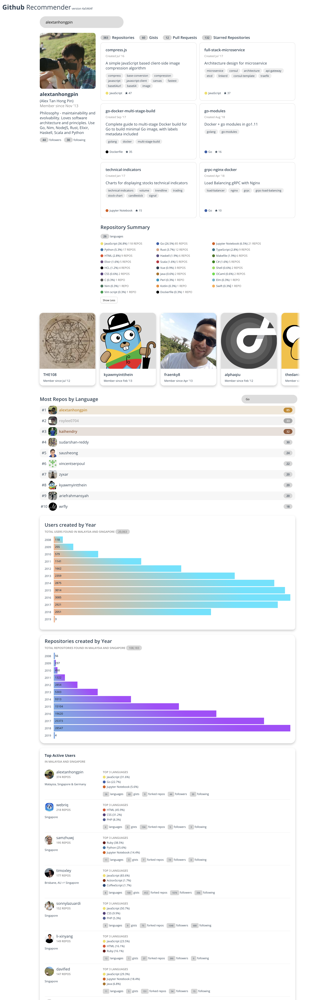

# github-scraper-sg

[](https://app.netlify.com/sites/upbeat-williams-20c757/deploys)

UI for the Github Scraper. The backend is available [here](https://github.com/alextanhongpin/go-github-scraper-sg)



## Project setup
```
yarn install
```

### Compiles and hot-reloads for development
```
yarn run serve
```

### Compiles and minifies for production
```
yarn run build
```

### Run your tests
```
yarn run test
```

### Lints and fixes files
```
yarn run lint
```

### Run your end-to-end tests
```
yarn run test:e2e
```

### Run your unit tests
```
yarn run test:unit
```

### Customize configuration
See [Configuration Reference](https://cli.vuejs.org/config/).
